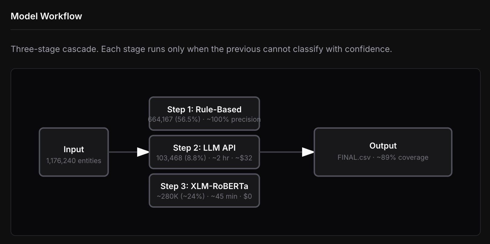

# Parent Entity Classification



Three-stage cascade: Rule-Based, LLM API, XLM-RoBERTa. Each stage runs only when the previous cannot classify with confidence.

## Overview

Classification of parent entities in vertical ownership chains across global markets. ~1.4M entities from 120+ countries, four categories:

- **Individual** – Personal names
- **Company** – Corporate entities (Inc., Ltd., GMBH, etc.)
- **Family Firm** – Family-owned (e.g. Smith & Sons Ltd)
- **Government** – Government agencies and public institutions

Research question: do ownership patterns (A → B → C chains) differ between widely held firms, family firms, and government-owned firms?

## Model Workflow

1. **Rule-based** – Keywords, suffixes (GMBH, INC, LTD), government patterns. 56.5% coverage.
2. **LLM API** – Claude Haiku via Anthropic Batches. 8.8% coverage.
3. **XLM-RoBERTa** – Trained on steps 1 and 2. Zero-cost inference. Target ~89% coverage.

## Data

### File structure

```
August/
├── done_processed_{CC}_data.csv      # Per-country CSV
├── done_processed_{CC}_data_stats.txt
└── ... (120+ countries)
```

### CSV columns

| Column       | Description          |
|--------------|----------------------|
| parent_name  | Entity name          |
| parent_id    | Orbis ID             |
| parent_city  | City                 |
| language     | Detected language    |
| entity_type  | individual, company, family_firm, government |

### Stats file

Per-country totals, language distribution, entity type distribution, corrections log.

## Web interface

- **Report** – Summary metrics, workflow diagram, classification results
- **Simulation** – Entity classification walkthrough
- **Data by Country** – Browse by country, view CSV, stats, charts

Hosted at [puneethkotha.github.io/Research-Data](https://puneethkotha.github.io/Research-Data/).

## Stack

HTML, CSS, JavaScript, Chart.js. No backend; data served as static files.

## Contact

Puneeth Kotha · NYU Stern
